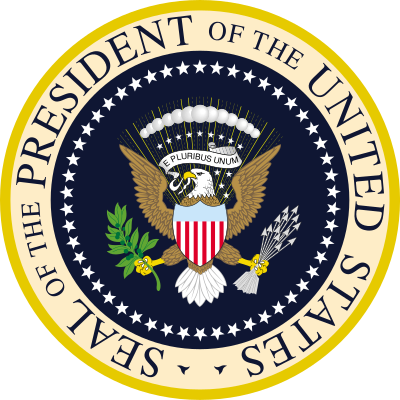

# Presidental Speeches Comparison Analysis Based on Political Party

---

<figure>

<figcaption>

*Put a caption to your image here, if you want*

</figcaption>

</figure>

1. Put an intro image above (if you want)
2. Change the 1st line of this file to the name of your project
3. Replace this list with the names of your group members, linking to email or github accounts (if you want)
4. Remember to also add your credits, introductions/summarys to the mkdocs.yml and README.md and docs/credits.md files.

---

This  pilot project will prove that there is great possibiity for academic discussion and digital research into the text analysis of Presidental Speeches. In this project, I will use various text-mining tools to analyze the speeches by poltical party and compare the results. In this I hope to discover something substainal, or at least to inspire further research into text-analysis of speeches.

---

Created as part of the course [HIS4936, Digital Humanities I: Hacking History](https://hacking-history.readthedocs.io), by [David J. Thomas](https://github.com/thePortus) at the [University of South Florida](https://www.usf.edu)

Powered with [MkDocs](https://mkdocs.org) and [Python 3](https://python.org)
