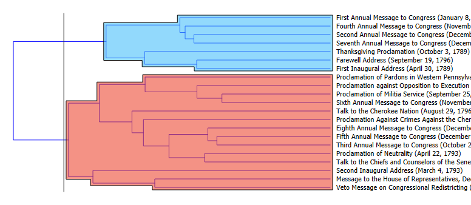
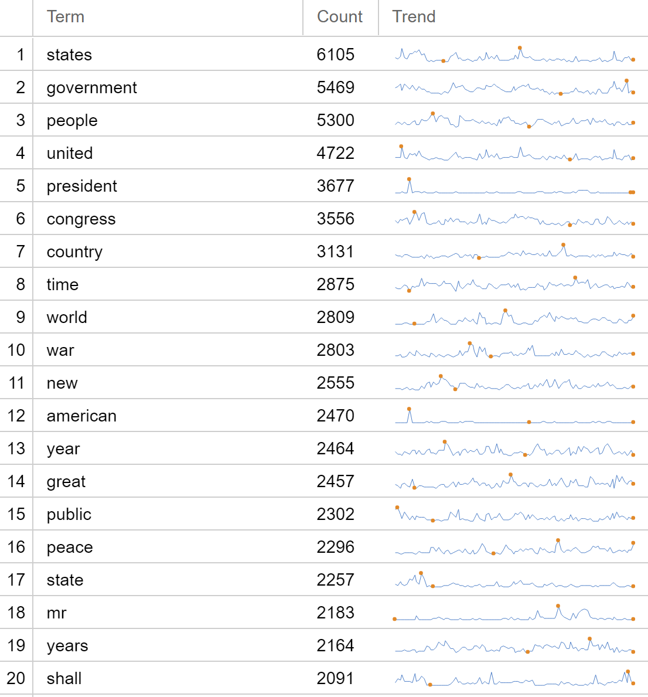
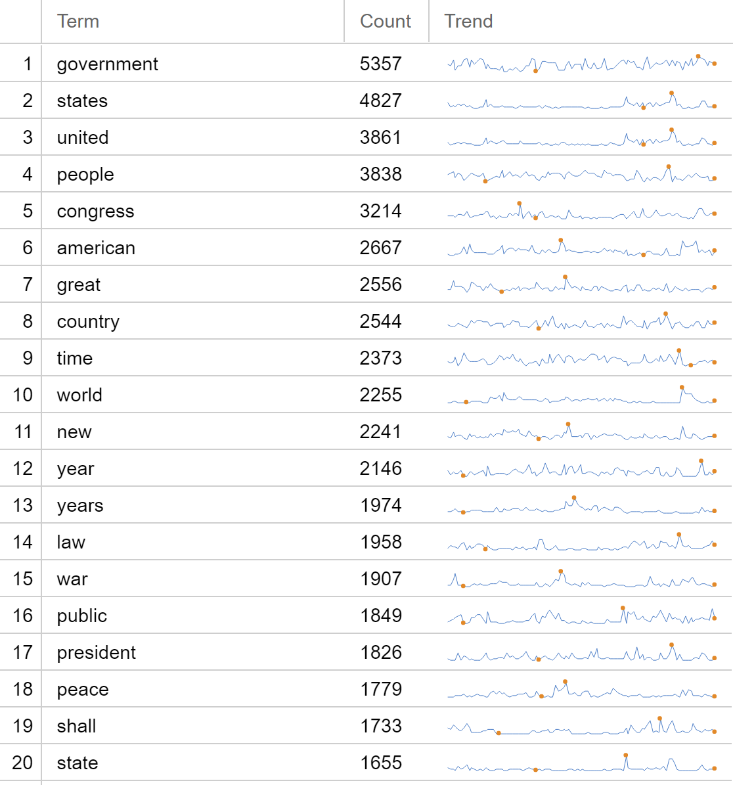
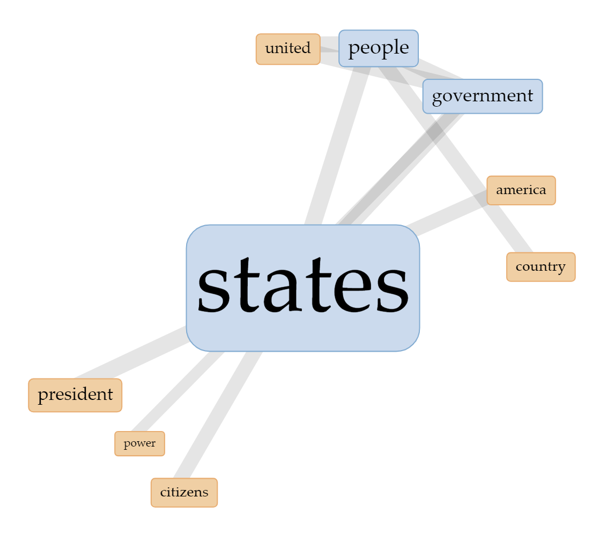
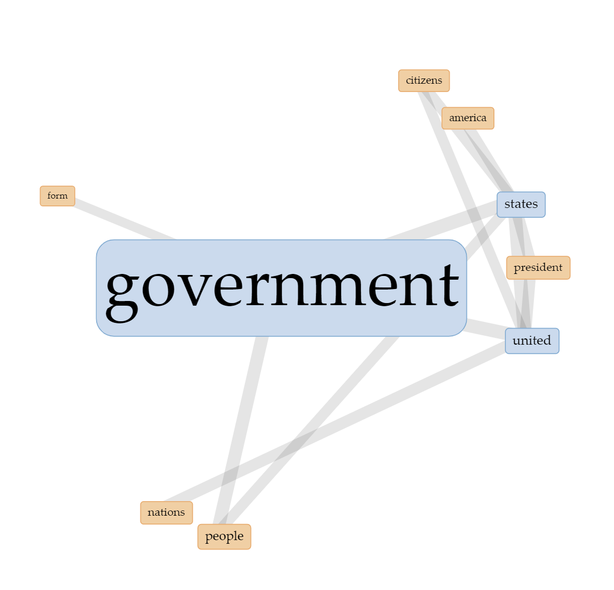
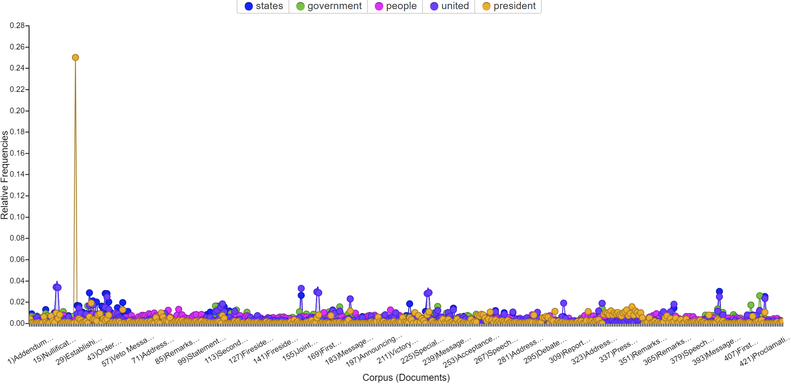
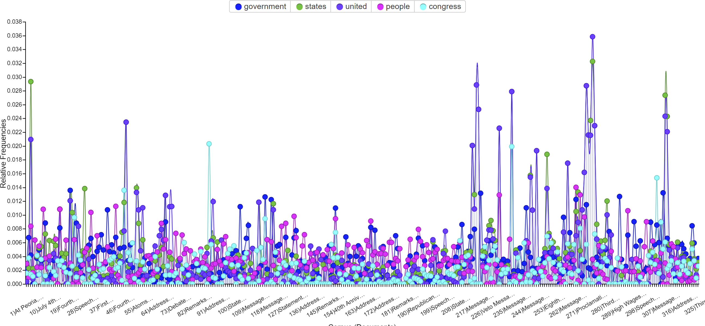

# Initial Findings

First and foremost, I wanted to experiment with a single president's speeches to see what the data looked like and how Orange 3 and Voyant could handle the data. Since I am separating the data by political party, I decided to utilize the one president that had no party affiliation: George Washington.

<figure>

<figcaption>

*Visualization created in Orange 3*

</figcaption>

</figure>

The visualization above done in Orange 3, represents 21 speeches given by George Washington between the years of 1789 and 1796. Using hierarchical clustering, I was able to determine that are two distinct categories of Washington’s speeches. It appears that the first cluster (colored blue) is primarily formal speeches like were likely very basic as far as presidential speeches go. For example, his “First Inaugural Address” and his “Farewell Address” are included in this category. The second cluster (colored red) alternatively includes some more complicated speeches, such as “Talk to the Cherokee Nation” and “Talk to the Chiefs and Counselors of the Senate.” These speeches are more likely to be longer and cover a more controversial topic, likely leading to more clarification needed by President Washington and therefore more detail and complicated ideas. I cannot definitively say that this is the reason for these clusters, it very well could be an oversimplification on my part. More digging into the clusters of speeches are required for a more accurate analysis.

---

Below are the various visualizations created using Voyant. It should be noted that not every president is included in this data, only those who were confirmed Democrats or Republicans. Therefore there are no presidents associated with the Whig Party, Democratic Republicans, or Federalists. I made this decision for simplicity's sake, but I do feel that it is worth further investigation by anyone who takes this research further.

Whether you turn your visualizations into static pictures and put them here or embed them, you MUST discuss your visualizations adequately. That means that whoever is the visualization expert must explain what they think the visualization means. You should explain anything that is not self-apparent from the picture alone. Moreover, you should at least comment on whether you think you can draw broader conclusions from any of the visualizations, either when considered individually or all together.

If your project was less visualization-centric, this is where you at least explain in plain words what you learned through the process of non-visual analysis. For example, if you used text mining not for visualization purposes, but to help you manually find interesting threads of conversation in a body of documents.

You should also make sure to be a cautious scholar, and to think about the limitations of what the visualizations can actually tell you. As indicated by the section name, you are **not** expected to make hard conclusions that upend serious historical debates. Rather, this is a place to explore what might be learned from visual exploration.

You must also comment on where you would go next. If these are initial findings, where do you think the best profit would be for any future attempts. This is also where you can talk about pitfalls that limited your ability to learn more about the topic. How might future projects overcome these difficulties?

---

This first set of visualizations highlight the word counts in Democratic and Republican Presidental Speeches. We can see that overall, these lists are very similar. However, in the Democratic list, words "war" and "president" have much higher word counts than on the Republican list. And the term "great" is present on the Republican list where it is not on the Democratic list. What this visualization shows us is that there is in fact a difference in the diction or chosen words of president's based on poltical affiliation. 

<figure>

<figcaption>

Democratic Speeches Word Count *Visualization created in Voyant*

</figcaption>

</figure>

<figure>

<figcaption>

Republican Speeches Word Count *Visualization created in Voyant*

</figcaption>

</figure>

---

Next, I have created work link visualizations. This visualization was far less successful in telling us something truely meaningful about the speeches, however, they do highlight the overall similarities in all Presidental Speeches based on the very nature of what they are. It makes sense that many of the same words are used in the same contexts throughout all speeches, regardless of poltical party.

<figure>

<figcaption>

Democratic Word Links *Visualization created in Voyant*

</figcaption>

</figure>

<figure>

<figcaption>

Republican Word Links *Visualization created in Voyant*

</figcaption>

</figure>

---

<figure>

<figcaption>

*Visualization created in Voyant*

</figcaption>

</figure>

<figure>

<figcaption>

*Visualization created in Voyant*

</figcaption>

</figure>
